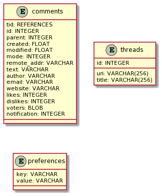

# sql2diagram

Generate database table diagram from SQL data definition. e.g. "CREATE TABLE ..."
See [Example](#example) below

## How does it works?

Analyze the SQL to generate PlantUML ER diagram,
then generate diagram image through PlantUML online service.

## Usage

### Setup

Install required dependence through `python3` virtual env:

```sh
python3 -m venv venv
. venv/bin/activate
pip3 install -r requirements.txt
```

### Command line options

```sh
$ ./sql2diagram.py -h
usage: sql2diagram.py [-h] [--output-file OUTPUT_FILE] input_file

SQL DDL to diagram

positional arguments:
  input_file            SQL DDL input file

optional arguments:
  -h, --help            show this help message and exit
  --output-file OUTPUT_FILE, -o OUTPUT_FILE
                        Output file. extension must be one of .puml, .png, .svg, .esp, .txt
```

### Example

```sh
$ ./sql2diagram.py sample/tables.sql
sample/tables.sql -> sample/tables.png
```

Input: [sample/tables.sql](sample/tables.sql):

```sql
CREATE TABLE comments (
    tid REFERENCES threads(id),
    id INTEGER PRIMARY KEY,
    parent INTEGER,
    created FLOAT NOT NULL,
    modified FLOAT,
    mode INTEGER,
    remote_addr VARCHAR,
    text VARCHAR,
    author VARCHAR,
    email VARCHAR,
    website VARCHAR,
    likes INTEGER DEFAULT 0,
    dislikes INTEGER DEFAULT 0,
    voters BLOB NOT NULL,
    notification INTEGER DEFAULT 0
);

CREATE TABLE threads (
    id INTEGER PRIMARY KEY,
    uri VARCHAR(256) UNIQUE,
    title VARCHAR(256)
);

CREATE TABLE preferences (
    key VARCHAR PRIMARY KEY,
    value VARCHAR
);
```

Output: default to _png_ image file:



## References

- [PlantUML Entity Relationship Diagram](https://plantuml.com/en/ie-diagram)
- [PlantUML Server](https://github.com/plantuml/plantuml-server)
- [PlantUML Text Encoding](https://plantuml.com/text-encoding)
- [python SQL parser to get the column name and data type](https://stackoverflow.com/questions/63247330/python-sql-parser-to-get-the-column-name-and-data-type)
